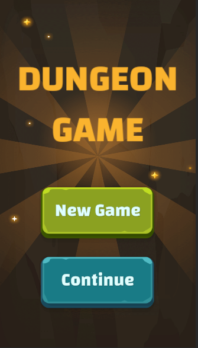
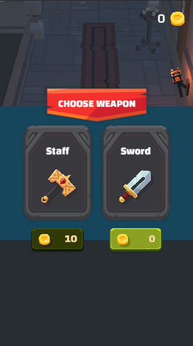
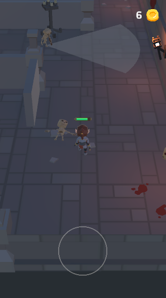
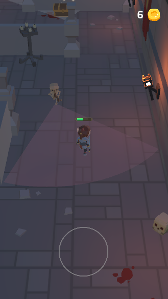
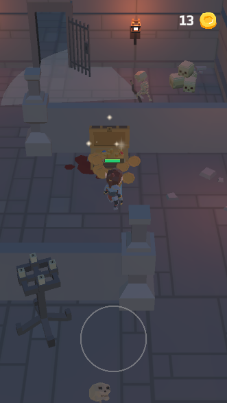
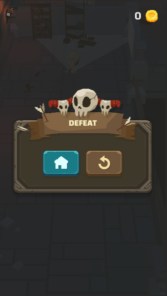

# Dungeon Game

## Introduction

A small three level mobile stealth game I made using Unity and C#. Choose your weapon and make your way through the levels fighting skeletons and collecting coins. With the coins you can buy better weapons.

My goal was to practice making a small game with a couple of levels, and having data persistence through the levels and game sessions. Making the game I learned to utilize different game design patterns and Unity features such as Events and Scriptable Objects.

Play the game on https://nnoora.itch.io/dungeon-game

## Future features
* More levels
* Variety of enemies (currently only one type)
* Other collectable objects, keys (currently only coins)
* Improvements on animations, VFX and sounds

  

  

 

